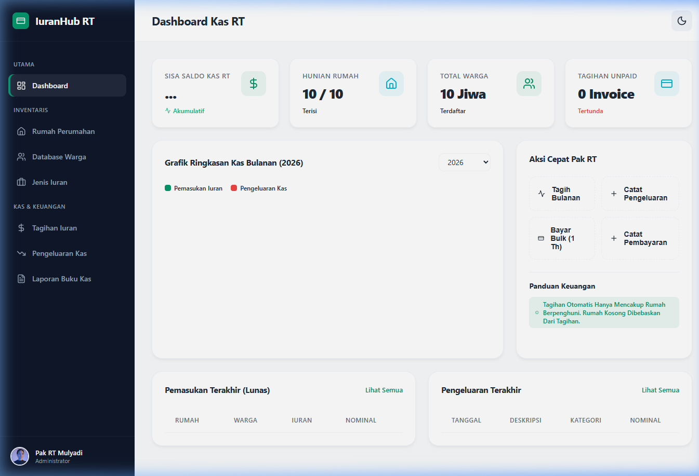
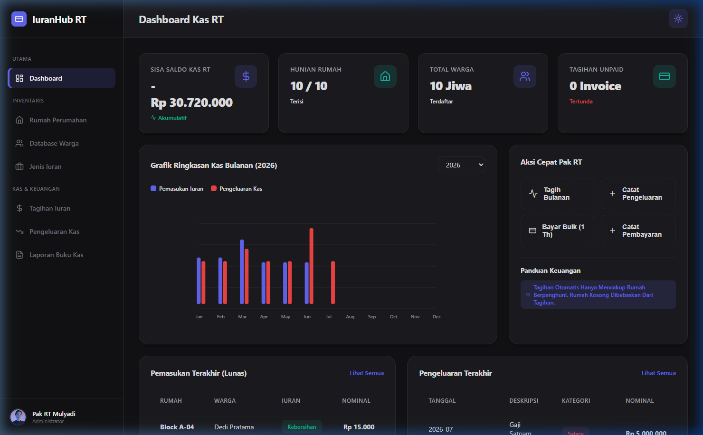
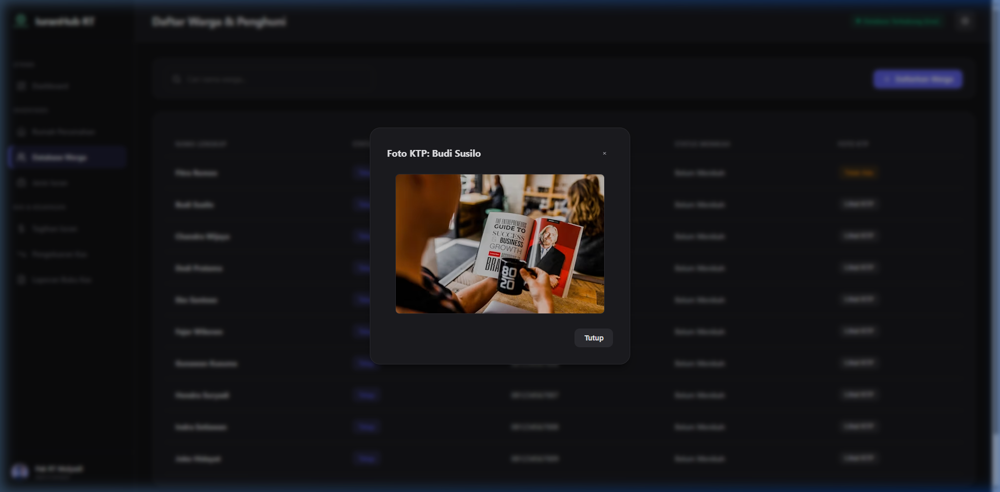
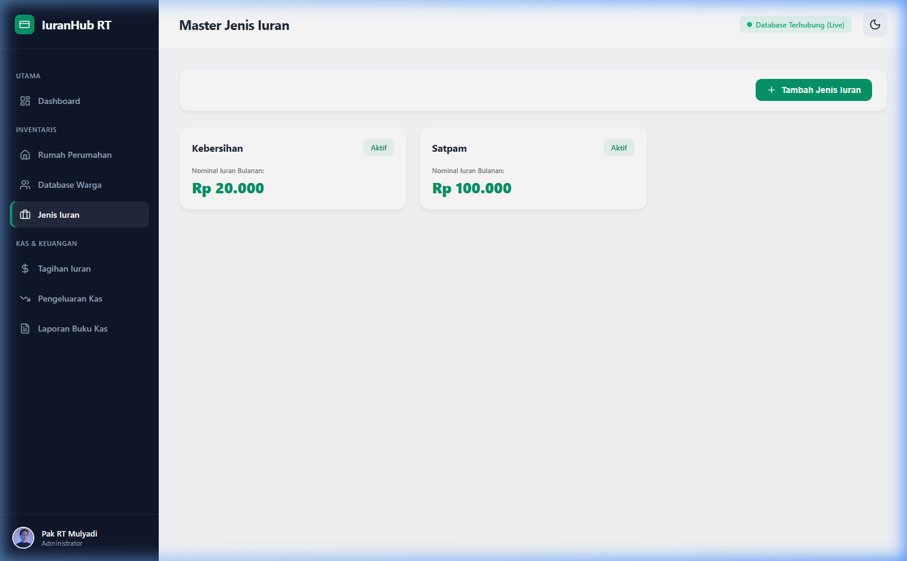
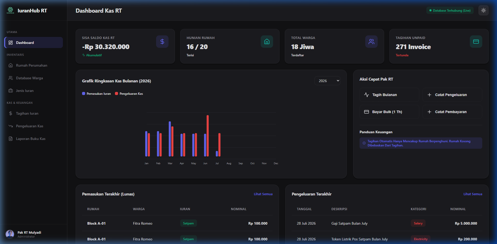
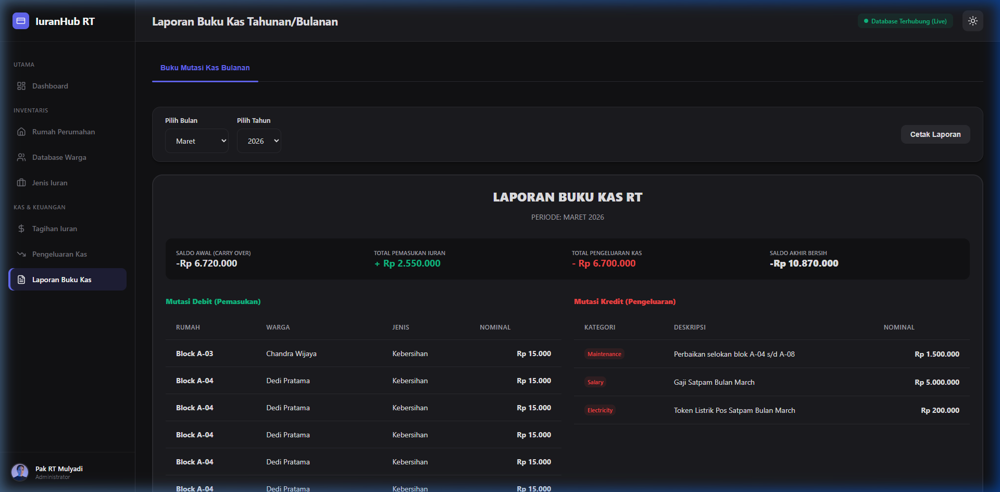

# IuranHub RT - Aplikasi Manajemen Keuangan & Iuran Perumahan RT

Aplikasi web modern (Single Page Application) berbasis **Vite + React (Frontend)** dan **Laravel 11 (Backend API)** yang dirancang khusus untuk mempermudah tugas Pak RT dalam mengelola keuangan, mendata hunian warga, menagih iuran bulanan secara dinamis, mengelola pengeluaran kas, serta menghasilkan buku kas bulanan siap cetak.

### 🛠️ Tech Stack & Library Utama:
* **Backend**: Laravel 11 (PHP 8.2+) dengan Eloquent ORM & SQLite/MySQL DB.
* **Frontend**: React 19 (JavaScript ES6+) & Vite 8.
* **Libraries & Assets**:
  * **`lucide-react`** (digunakan untuk memuat ikon-ikon premium di menu navigasi, kartu metrik KPI, dan aksi dashboard).
  * **Vanilla CSS Modern** (styling sistem warna dinamis Light/Dark mode).


---

## 📸 Dokumentasi & Hasil Tugas (Screenshots Fitur)

Berikut adalah rangkuman visual dari setiap fitur premium yang telah berhasil dibangun dan diintegrasikan:

### 1. Dashboard Utama (Light Mode)
Tampilan ringkasan metrik KPI (Sisa Saldo Kas, Tingkat Hunian Rumah, Total Warga, Tagihan Unpaid) yang terintegrasi live dengan database, dilengkapi grafik visual mutasi kas bulanan (SVG), menu Aksi Cepat, serta daftar mutasi pemasukan/pengeluaran lunas terbaru.


### 2. Dashboard Utama (Dark Mode)
Aplikasi mendukung mode gelap dengan transisi halus menggunakan skema kombinasi warna premium (Rich Charcoal, Zinc Light, Vibrant Indigo, dan Teal).


### 3. Inventaris Hunian Rumah
Mengelola penempatan warga pada blok-blok rumah secara dinamis (Check-in/Check-out warga) dengan sinkronisasi status otomatis (Rumah Dihuni / Rumah Kosong).
 *(Catatan: Kelola Hunian Blok Rumah dapat dibuka di tab Rumah Perumahan)*

### 4. Database Warga & Foto KTP Asli
Manajemen data warga (tipe tinggal tetap/kontrak, nomor telepon, status pernikahan) lengkap dengan fitur unggah file foto KTP asli dan modal pop-up preview untuk menampilkan gambar KTP secara langsung.


### 5. Master Tarif Jenis Iuran
Memungkinkan admin (Pak RT) membuat kategori iuran baru beserta tarif bulanan secara dinamis (misal: Satpam, Kebersihan, Dana Sosial).


### 6. Transaksi Tagihan & Pembayaran
Pencatatan tagihan iuran bulanan, pencatatan pembayaran manual, serta fitur pembayaran bulk (sekaligus) hingga 1 tahun ke depan untuk warga yang ingin membayar di muka.


### 7. Pengeluaran Kas RT
Pencatatan pengeluaran operasional (seperti gaji satpam, token listrik pos keamanan, perawatan sarana prasarana) untuk transparansi kas RT.
 *(Catatan: Riwayat pengeluaran kas selengkapnya dapat dibuka di tab Pengeluaran Kas)*

### 8. Laporan Buku Kas Bulanan (Mutasi Debit/Kredit)
Menampilkan mutasi saldo kas secara terperinci setiap bulannya, carry-over saldo awal (laba/rugi bulan sebelumnya), serta mendukung fitur cetak langsung (print friendly layout).


---

## 🛠️ Panduan Instalasi Lengkap (Untuk Laptop Bersih)

Panduan ini ditulis dengan asumsi laptop Anda **benar-benar baru / bersih** dan belum terinstal software developer apa pun. Ikuti langkah-langkah di bawah ini secara berurutan:

### Langkah 1: Instalasi Node.js & NPM (Untuk Frontend React)
1. Unduh installer Node.js versi LTS terbaru di situs resmi: [https://nodejs.org/](https://nodejs.org/)
2. Jalankan installer (`.msi` untuk Windows atau `.pkg` untuk macOS).
3. Klik **Next** terus-menerus dan biarkan pengaturan default (jangan lupa centang opsi untuk menambahkan ke PATH).
4. Selesaikan instalasi. Buka CMD/Terminal baru dan ketik perintah berikut untuk memverifikasi instalasi:
   ```bash
   node -v
   npm -v
   ```
   *(Harus memunculkan versi Node.js dan NPM, misal: v18.x.x atau v20.x.x)*

### Langkah 2: Instalasi PHP & MySQL (Rekomendasi Tercepat via Laragon)
*Laragon adalah aplikasi server lokal terbaik untuk Windows yang sudah membundel PHP 8.x, MySQL 3306, Apache, dan Composer sekaligus dalam satu paket.*

1. Unduh Laragon Wamp (pilih versi **Laragon Full**) di: [https://laragon.org/download/](https://laragon.org/download/)
2. Jalankan file `.exe` yang diunduh dan ikuti panduan instalasinya sampai selesai.
3. Buka aplikasi Laragon, lalu klik tombol **Start All** di bagian bawah.
4. Membuat database baru:
   * Klik kanan di area mana saja di dalam Laragon -> pilih **Database** -> **Create Database**.
   * Masukkan nama database: `iuran-hub`.
   * Klik **OK** (Database kosong berhasil dibuat dengan username bawaan: `root` dan password: `` (kosong)).

*(Alternatif jika Anda menggunakan **XAMPP**: Unduh XAMPP dengan PHP 8.2+ di apachefriends.org, aktifkan module Apache & MySQL pada Control Panel, buka http://localhost/phpmyadmin, lalu buat database bernama `iuran-hub`)*

### Langkah 3: Konfigurasi & Menjalankan Backend API (Laravel)
1. Buka CMD / Terminal / PowerShell Anda.
2. Arahkan folder CMD ke direktori **`backend-iuranhub`** di dalam project ini. (Contoh: `cd d:\Projects\Skill Fit Test BEON Intermedia\backend-iuranhub`).
3. Buat file konfigurasi `.env` dengan menyalin file contoh:
   ```bash
   copy .env.example .env
   ```
4. Buka file `.env` menggunakan notepad, lalu pastikan baris database terkonfigurasi seperti berikut:
   ```env
   DB_CONNECTION=mysql
   DB_HOST=127.0.0.1
   DB_PORT=3306
   DB_DATABASE=iuran-hub
   DB_USERNAME=root
   DB_PASSWORD=
   ```
5. Install semua dependensi PHP menggunakan Composer (Composer sudah terinstal otomatis jika menggunakan Laragon):
   ```bash
   composer install
   ```
6. Jalankan generate key aplikasi Laravel:
   ```bash
   php artisan key:generate
   ```
7. Jalankan proses migrasi tabel database dan masukkan data demo awal (seeder):
   ```bash
   php artisan migrate:fresh --seed
   ```
8. Hubungkan folder storage agar foto KTP warga yang diupload dapat diakses oleh browser:
   ```bash
   php artisan storage:link
   ```
9. Jalankan server backend API Laravel:
   ```bash
   php artisan serve
   ```
   *(Server backend akan berjalan aktif di alamat `http://127.0.0.1:8000`)*

### Langkah 4: Konfigurasi & Menjalankan Frontend Client (Vite React)
1. Buka CMD / Terminal baru (jangan menutup CMD backend yang sedang berjalan).
2. Arahkan CMD ke direktori **`iuranhub`** di dalam project ini. (Contoh: `cd d:\Projects\Skill Fit Test BEON Intermedia\iuranhub`).
3. Install semua dependensi Node modules (termasuk library icon `lucide-react`):
   ```bash
   npm install
   ```
4. Jalankan Vite development server:
   ```bash
   npm run dev
   ```
5. Setelah server berjalan, buka browser kesayangan Anda dan akses alamat berikut:
   ```text
   http://localhost:5173/
   ```

Aplikasi **IuranHub RT** kini siap digunakan sepenuhnya dengan data simulasi awal yang lengkap!
