# 🏠 IuranHub RT

### Aplikasi Manajemen Keuangan & Iuran Perumahan RT

Aplikasi web modern berbasis **Vite + React (Frontend)** dan **Laravel 13 (Backend API)** yang dirancang khusus untuk mempermudah tugas Pak RT dalam mengelola keuangan, mendata hunian warga, menagih iuran bulanan secara otomatis, mengelola pengeluaran kas, serta menghasilkan buku kas bulanan siap cetak secara profesional.

---

## 🛠️ Tech Stack

| Lapisan      | Teknologi                       | Versi                           |
| ------------ | ------------------------------- | ------------------------------- |
| **Frontend** | React + Vite (JavaScript ES6+)  | React `^19.2.7` · Vite `^8.1.1` |
| **Backend**  | Laravel + Eloquent ORM          | Laravel `^13.8` · PHP `^8.3`    |
| **Database** | MySQL                           | `8.x`                           |
| **Icons**    | lucide-react                    | `^1.25.0`                       |
| **Styling**  | Vanilla CSS (Dark / Light Mode) | —                               |

---

## 📸 Fitur & Dokumentasi Visual

### 1. Halaman Login (Autentikasi Admin)

Sistem masuk aman menggunakan token-based session yang didukung oleh Laravel Sanctum. Menjamin hanya pengurus RT (Administrator) terverifikasi yang dapat mengelola data keuangan dan hunian.

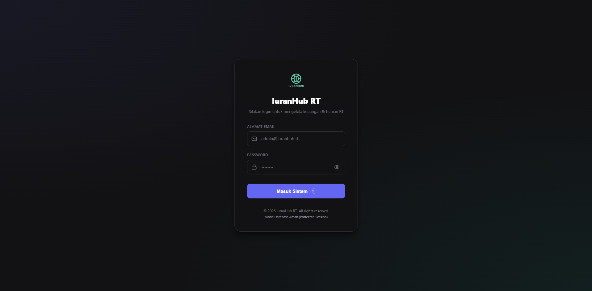

---

### 2. Dashboard Utama

Ringkasan metrik KPI real-time: Sisa Saldo Kas, Tingkat Hunian Rumah, Total Warga Terdaftar, dan Tagihan Belum Dibayar. Dilengkapi grafik batang mutasi kas bulanan, panel Aksi Cepat Pak RT, serta daftar transaksi terbaru.

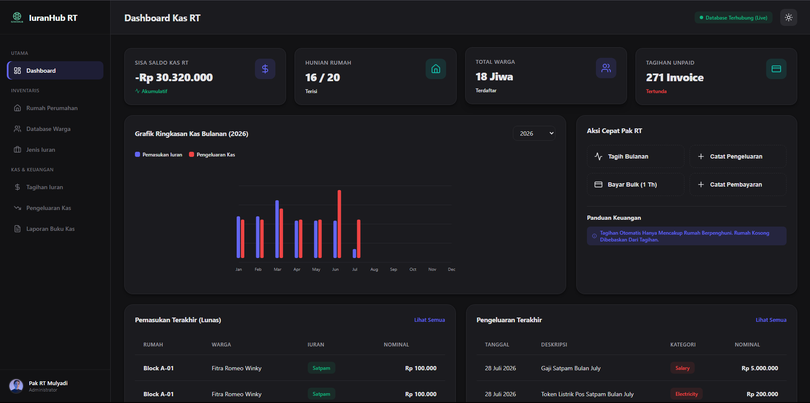

---

### 3. Kelola Inventaris Rumah

Manajemen seluruh blok rumah di perumahan. Setiap kartu rumah menampilkan status hunian (Dihuni / Kosong), nama penghuni aktif, dan aksi cepat untuk edit atau hapus data rumah.

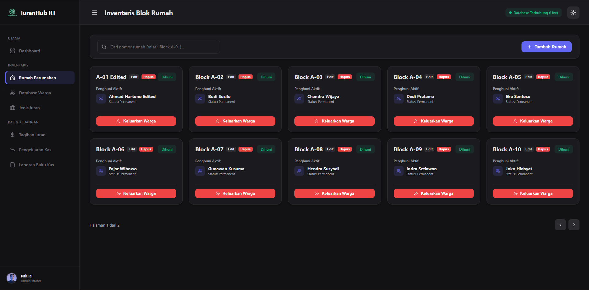

---

### 4. Tambah Data Rumah

Form modal untuk menambahkan blok rumah baru ke dalam sistem dengan nomor blok dan keterangan.

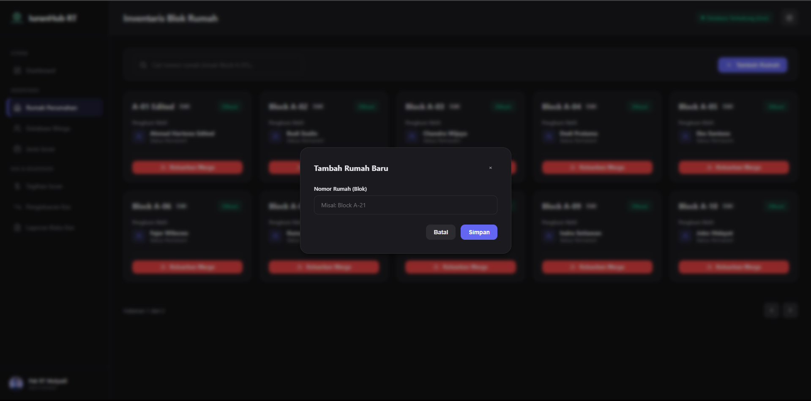

---

### 5. Edit Data Rumah

Form modal edit data rumah yang sudah ada, memungkinkan perubahan nomor blok dan informasi terkait.

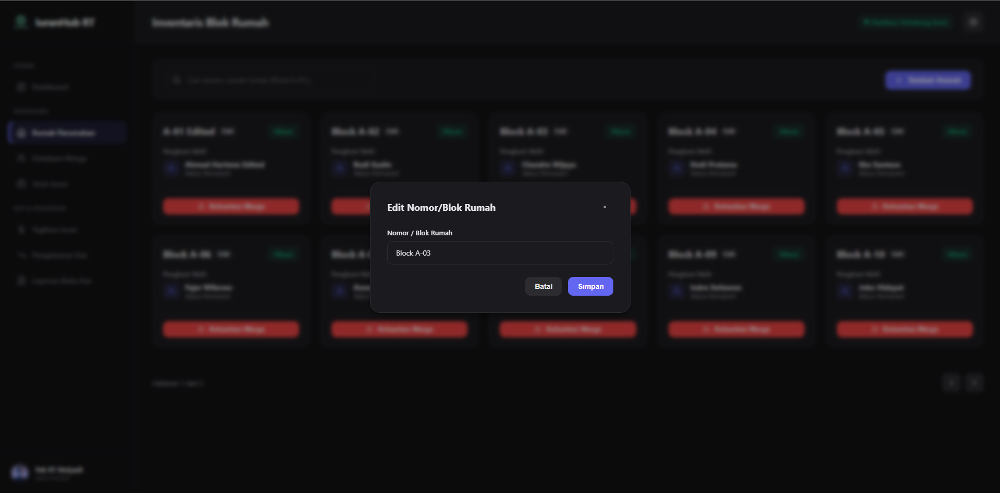

---

### 6. History Hunian Rumah

Setiap rumah memiliki catatan historis siapa saja yang pernah menghuni. Klik pada kartu rumah untuk membuka modal detail yang menampilkan riwayat lengkap penghuni beserta tanggal masuk dan keluar.

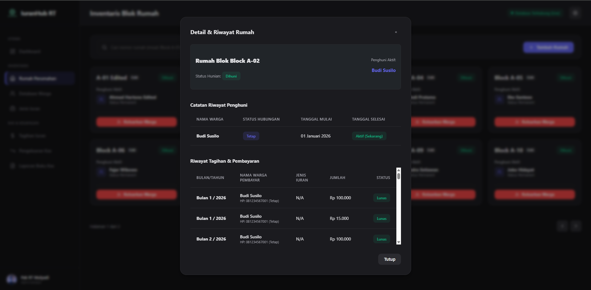

---

### 7. Kelola Database Warga

Tabel data seluruh warga perumahan beserta informasi kontak, jenis tinggal (Tetap / Kontrak), dan status aktif. Terdapat aksi tambah, edit, dan hapus warga.

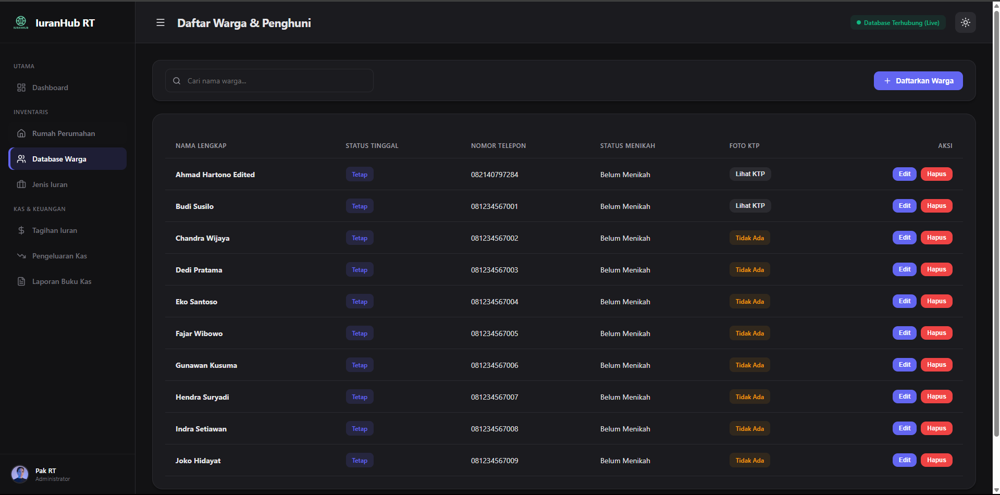

---

### 8. Tambah Data Warga

Form modal lengkap untuk mendaftarkan warga baru ke dalam sistem, termasuk nama lengkap, nomor telepon, dan tipe hunian.

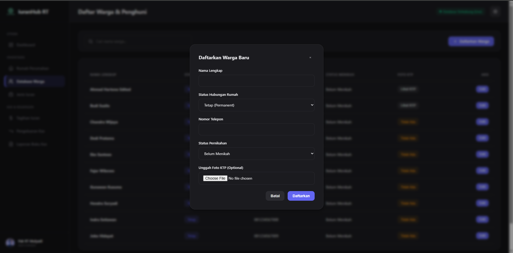

---

### 9. Edit Data Warga

Form modal edit untuk memperbarui informasi warga yang sudah terdaftar.

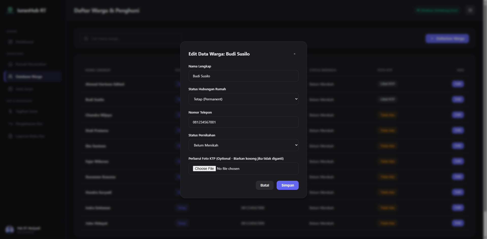

---

### 10. Master Jenis Iuran

Mengelola kategori dan tarif iuran secara dinamis (contoh: Kebersihan, Satpam, Dana Sosial). Admin dapat menambah, mengedit, dan menghapus jenis iuran sesuai kebutuhan perumahan.

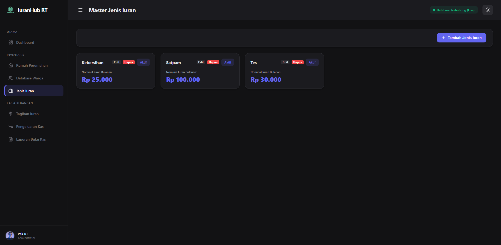

---

### 11. Kelola Tagihan Iuran

Daftar seluruh tagihan iuran warga dengan status Lunas / Belum Bayar. Mendukung filter berdasarkan bulan, tahun, dan blok rumah.

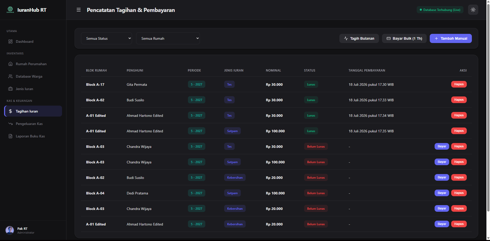

---

### 12. Generate Tagihan Bulanan Otomatis

Fitur "Tagih Bulanan" membuat tagihan iuran secara otomatis untuk seluruh rumah yang berpenghuni sesuai jenis iuran aktif — hanya dengan satu kali klik. Rumah kosong otomatis dibebaskan dari tagihan.

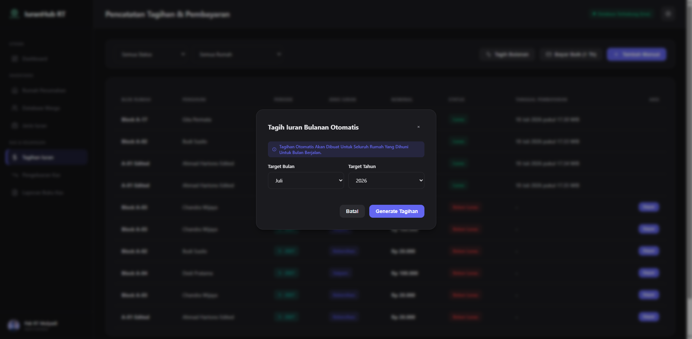

---

### 13. Pembayaran Manual per Tagihan

Konfirmasi pembayaran individual disertai countdown 5 detik dengan opsi Batalkan Pembayaran sebelum transaksi dikunci ke database.

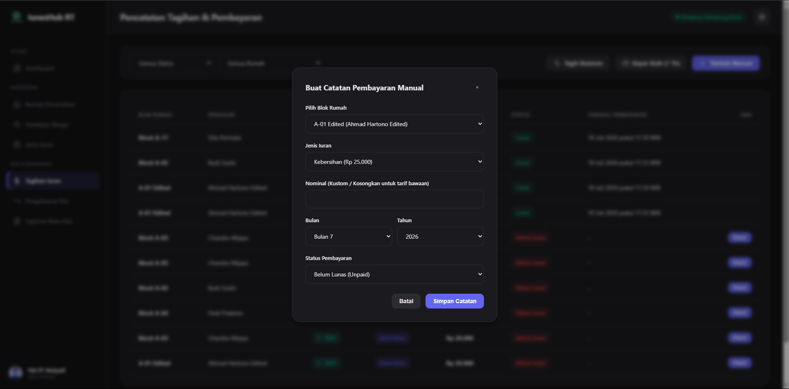

---

### 14. Pembayaran Sekaligus (Bulk Pay)

Warga dapat membayar iuran di muka hingga 1 tahun ke depan sekaligus dalam satu transaksi, memudahkan pengelolaan kas jangka panjang.

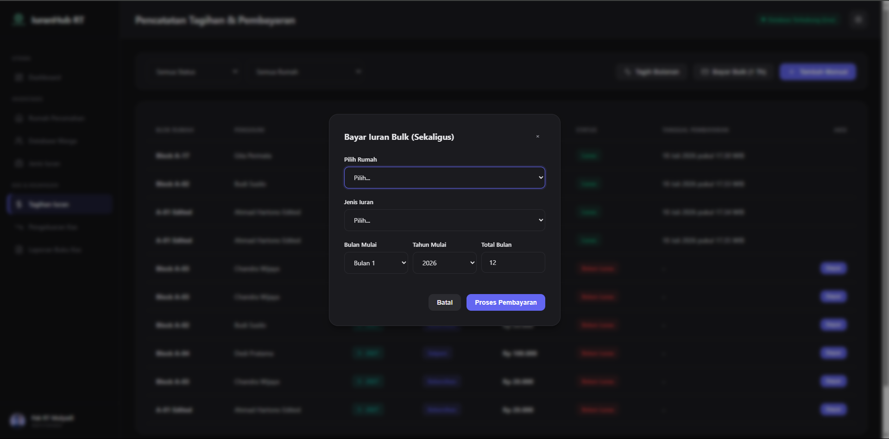

---

### 15. Kelola Pengeluaran Kas

Pencatatan seluruh pengeluaran operasional RT (gaji satpam, token listrik, perawatan sarana) secara terperinci dengan kategori, deskripsi, dan nominal. Mendukung tambah, edit, dan hapus pengeluaran.

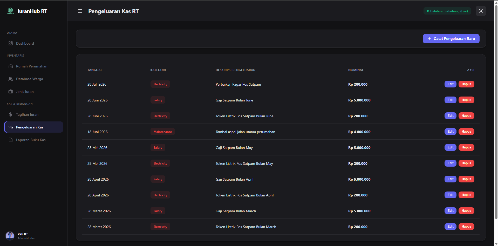

---

### 16. Edit Data Pengeluaran Kas

Form modal untuk memperbarui catatan pengeluaran kas yang sudah tercatat, termasuk kategori, deskripsi, nominal, dan tanggal pengeluaran.

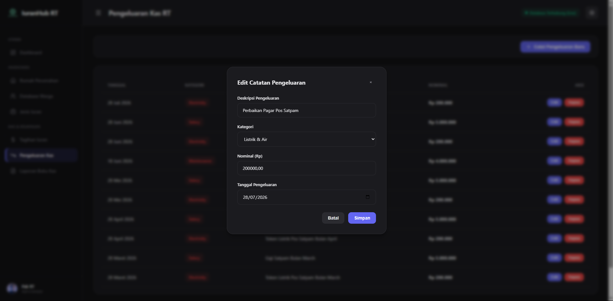

---

### 17. Laporan Buku Kas Bulanan (Tampilan Web)

Menampilkan mutasi saldo kas secara terperinci setiap bulan: saldo awal carry-over, total pemasukan iuran, total pengeluaran, dan saldo akhir bersih — disajikan dalam dua tabel sejajar (debit dan kredit).

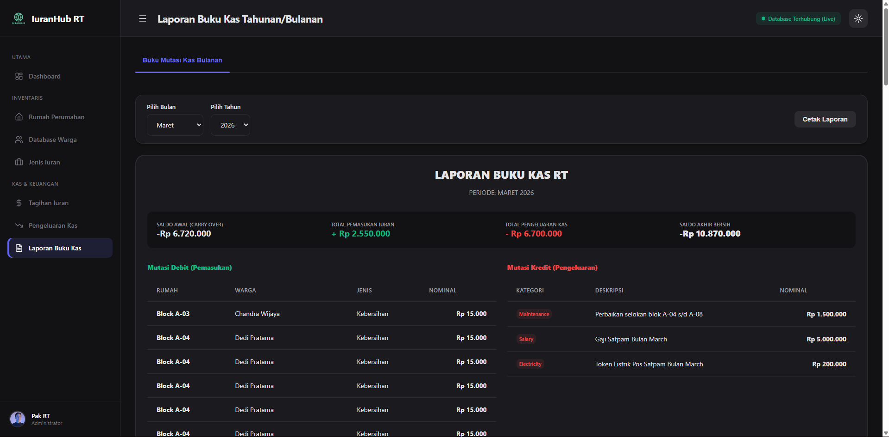

---

### 18. Laporan Buku Kas (Cetak PDF)

Laporan buku kas siap cetak dengan format dokumen resmi bergaya profesional: kop surat dengan logo RT, seksi bernomor (Ringkasan, Mutasi Debit, Mutasi Kredit, Rekap Saldo Akhir), tabel dengan nomor urut dan baris subtotal, serta footer tanggal cetak otomatis.

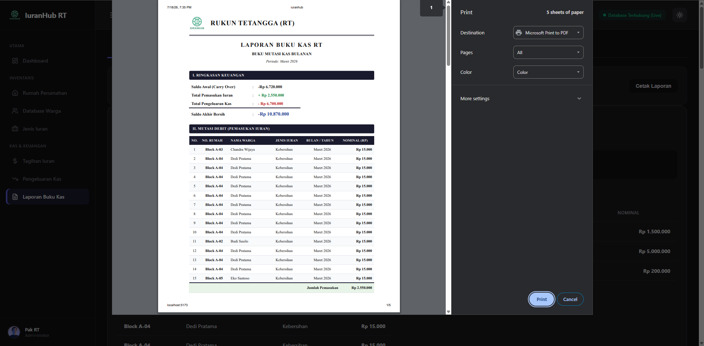

---

## 🚀 Panduan Instalasi Lengkap (Untuk Laptop Bersih)

Panduan ini ditulis dengan asumsi laptop Anda **benar-benar baru / bersih** dan belum terinstal software developer apa pun. Ikuti setiap langkah secara **berurutan**.

---

### Langkah 1 — Instalasi Node.js & NPM (Runtime Frontend)

1. Buka browser dan unduh installer Node.js versi **LTS** terbaru di: [https://nodejs.org/](https://nodejs.org/)
2. Jalankan file installer `.msi` (Windows) dan klik **Next** hingga selesai.  
   _(Pastikan opsi "Add to PATH" dalam keadaan tercentang)_
3. Buka **Command Prompt** baru dan verifikasi instalasi:
   ```bash
   node -v
   npm -v
   ```
   Harus menampilkan nomor versi — contoh: `v20.x.x` dan `10.x.x`.

---

### Langkah 2 — Instalasi PHP & MySQL via Laragon

> **Laragon** adalah cara tercepat mendapatkan PHP 8.x + MySQL + Composer sekaligus dalam satu paket di Windows.

1. Unduh **Laragon Full** di: [https://laragon.org/download/](https://laragon.org/download/)
2. Jalankan installer `.exe` dan ikuti hingga selesai.
3. Buka aplikasi **Laragon**, klik tombol **Start All**.
4. Buat database kosong:
   - Klik kanan di area Laragon → **Database** → **Create Database**
   - Nama database: `iuran-hub`
   - Klik **OK**
   - _(Username default: `root`, Password: kosong/tidak ada)_

> **Alternatif XAMPP**: Unduh XAMPP (PHP 8.2+) di [apachefriends.org](https://www.apachefriends.org/), aktifkan modul **Apache** dan **MySQL**, buka `http://localhost/phpmyadmin`, lalu buat database bernama `iuran-hub`.

---

### Langkah 3 — Konfigurasi & Menjalankan Backend API (Laravel)

1. Buka **Command Prompt** dan masuk ke folder backend:

   ```bash
   cd "d:\Projects\Skill Fit Test BEON Intermedia\backend-iuranhub"
   ```

2. Salin file konfigurasi `.env`:

   ```bash
   copy .env.example .env
   ```

3. Buka file `.env` dengan Notepad dan pastikan bagian database seperti berikut:

   ```env
   DB_CONNECTION=mysql
   DB_HOST=127.0.0.1
   DB_PORT=3306
   DB_DATABASE=iuran-hub
   DB_USERNAME=root
   DB_PASSWORD=
   ```

4. Install semua dependensi PHP:

   ```bash
   composer install
   ```

5. Generate application key:

   ```bash
   php artisan key:generate
   ```

6. Jalankan migrasi tabel dan data demo awal (seeder):

   ```bash
   php artisan migrate:fresh --seed
   ```

7. Buat symlink storage (untuk foto profil warga):

   ```bash
   php artisan storage:link
   ```

8. Jalankan server backend:
   ```bash
   php artisan serve
   ```
   ✅ Backend berjalan di: `http://127.0.0.1:8000`

---

### Langkah 4 — Konfigurasi & Menjalankan Frontend (Vite React)

1. Buka **Command Prompt baru** (jangan tutup terminal backend).
2. Masuk ke folder frontend:

   ```bash
   cd "d:\Projects\Skill Fit Test BEON Intermedia\iuranhub"
   ```

3. Install semua dependensi Node:

   ```bash
   npm install
   ```

4. Jalankan Vite development server:

   ```bash
   npm run dev
   ```

5. Buka browser dan akses:
   ```
   http://localhost:5173/
   ```
   ✅ Aplikasi **IuranHub RT** siap digunakan!

6. Masuk ke Dashboard menggunakan akun administrator default:
   - **Email**: `admin@iuranhub.rt`
   - **Password**: `pakrt2024`

---

### Langkah 5 — Solusi Jika Icon Tidak Muncul (Error `lucide-react`)

Jika setelah `npm install` icon-icon navigasi tidak muncul atau muncul error di browser console:

1. Pastikan CMD berada di folder `iuranhub`.
2. Install ulang library icon secara manual:
   ```bash
   npm install lucide-react
   ```
3. Restart server Vite (`Ctrl + C` → `npm run dev`).

---

> Aplikasi **IuranHub RT** kini siap digunakan sepenuhnya dengan data simulasi awal yang lengkap. Selamat mencoba! 🎉
